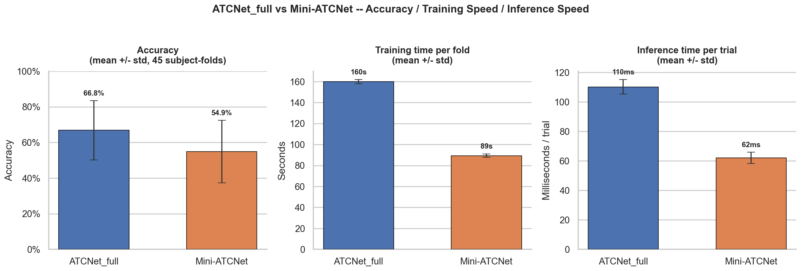
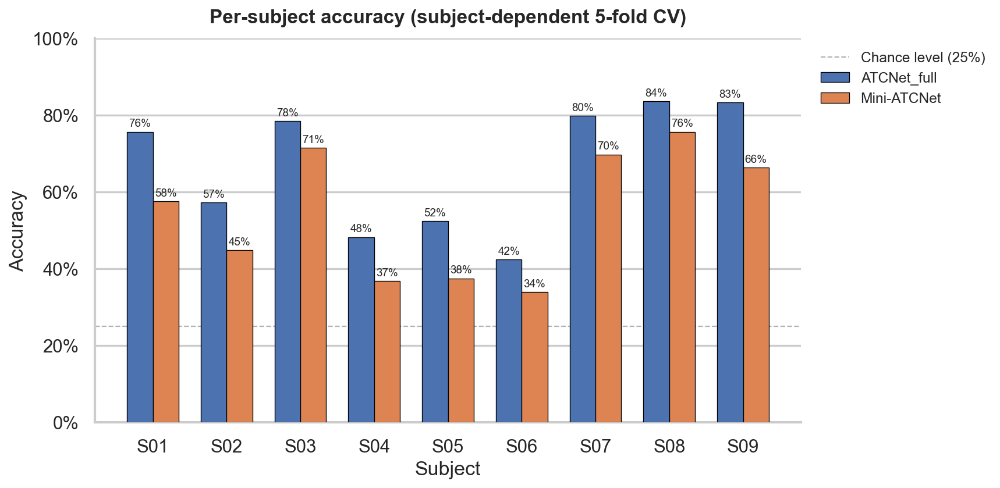
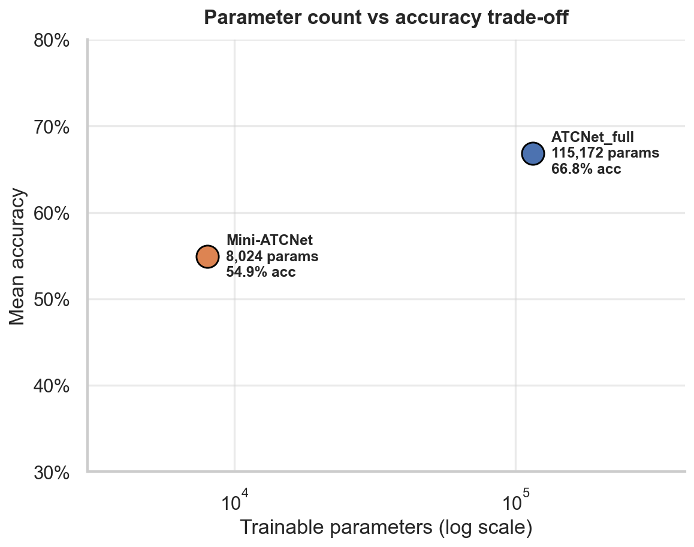
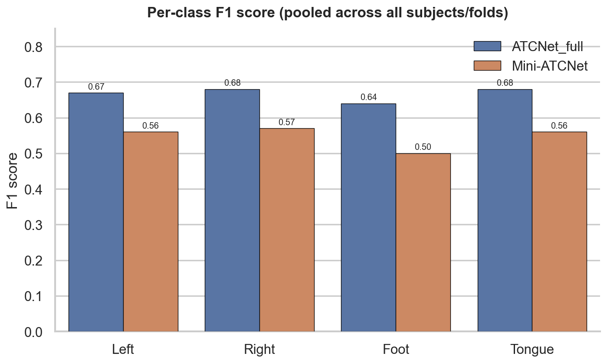

# ATCNet vs. Mini-ATCNet — Motor Imagery EEG Classification (BCI Competition IV-2a)

Accuracy / training-speed / inference-speed comparison between a published EEG deep learning
architecture and a self-designed lightweight variant of it, evaluated under a leakage-free,
subject-dependent cross-validation protocol on the BCI Competition IV-2a dataset.

## Motivation

Assistive BCI systems — for example, decoding motor imagery for users who cannot execute a
physical movement but can still generate the corresponding motor-cortex activity — need to run
in real time, often on modest hardware close to the user rather than a full GPU workstation. That
latency and footprint constraint is a real deployment concern, not just a modeling preference, and
it motivated the central question of this project: **what accuracy do you actually give up if you
shrink a strong published EEG architecture down for that constraint, and by how much do you gain
back in speed?**

## Why ATCNet

[ATCNet](https://github.com/Altaheri/EEG-ATCNet) (Altaheri, Muhammad, Alsulaiman — *IEEE
Transactions on Industrial Informatics*, 2023, [10.1109/TII.2022.3197419](https://doi.org/10.1109/TII.2022.3197419))
was chosen as the base architecture because it is a real, published, widely-cited (600+) model
that reports 81.10% accuracy on BCI IV-2a with 113,732 parameters (official numbers from the
paper's own repository). It combines three block types — a convolutional block (temporal +
depthwise spatial + separable convolutions, the same family as EEGNet), a sliding-window
multi-head self-attention block, and a temporal convolutional network (dilated causal residual
convolutions) — fused by averaging each window's per-class logits. The `ATCNet_full` configuration
in this repo reimplements it directly from the official `models.py` / `attention_models.py`, using
the paper's own default hyperparameters.

## Why a lightweight variant (Mini-ATCNet)

**Mini-ATCNet is not a name or architecture from the literature** — there is no published paper by
that name; it is a self-designed lightweight variant built by deliberately shrinking ATCNet's own
hyperparameters, not a different architecture family. Every deviation is explicit:

| Hyperparameter | ATCNet_full (paper default) | Mini-ATCNet | Why Mini shrinks it |
|---|---|---|---|
| `eegn_F1` (temporal filters) | 16 | **8** | Halves the width of every downstream layer (`F2 = F1 x D` cascades through the rest of the network) |
| `eegn_D` (depthwise multiplier) | 2 | **1** | Avoids doubling channels after the depthwise spatial conv |
| `n_windows` (sliding-window count) | 5 | **3** | Each window gets its own TCN block + Dense head — the single biggest parameter-count lever |
| `tcn_filters` | 32 | **16** | Matches the halved `F2` from the smaller conv block |
| `tcn_depth` | 2 | **1** | One dilated residual block instead of two |
| MHA `num_heads` | 2 | **1** | A single attention head over an already-small feature dimension |
| MHA `key_dim` | 8 | **4** | Matches the halved feature width |

Everything not listed above (causal dilated TCN convolutions, average-fusion across sliding
windows, the depthwise-then-separable conv block, `max_norm` weight constraints, ELU activations)
is structurally identical between the two configurations. The motivation for building it is the
real-time/embedded deployment constraint described above, not limited compute during development —
this notebook exists specifically to measure whether that trade-off is worth it, not to assume it.

## Dataset and protocol

- **BCI Competition IV-2a**: 9 subjects, 4-class motor imagery (left hand / right hand / foot /
  tongue), 22 EEG channels, 250 Hz. ([Dataset description](https://www.bbci.de/competition/iv/desc_2a.pdf))
- **Trial-level epoching**: each trial is exactly one [0, 4]s motor-imagery window — no
  overlapping sliding windows, so no trial's samples can leak across a train/test split.
- **Subject-dependent 5-fold cross-validation**, per subject, then averaged across all 9 subjects
  x 5 folds = 45 subject-fold runs per configuration.
- **Raw band-pass filtered EEG** as input (4-40 Hz) — no CSP or hand-crafted features; the
  network's own depthwise convolution learns spatial filtering directly from data.
- **Data augmentation** (jitter, scaling, magnitude-warping) applied to the inner-training split
  only, and a **linear learning-rate warm-up** over the first 10 epochs — both added after an
  initial run showed every fold using its full epoch budget without early stopping ever
  triggering; both confirmed to improve accuracy for both configurations without any architecture
  change (see `notebooks/02_atcnet_vs_mini_atcnet_augment_lrwarmup.ipynb` for the full debugging
  history, including two earlier training-instability bugs that had to be fixed first: a stuck
  optimizer near initialization, and an XLA recompilation cost from varying batch shapes).

## Results

45 subject-fold runs per configuration (9 subjects x 5 folds), subject-dependent 5-fold CV, with
augmentation + LR warm-up.

| | ATCNet_full | Mini-ATCNet |
|---|---|---|
| Trainable parameters | 115,172 | 8,024 (7.0% of full) |
| Mean accuracy | **66.8% ± 16.6%** | **54.9% ± 17.5%** |
| Mean F1 (macro) | 0.660 ± 0.171 | 0.521 ± 0.182 |
| Mean training time / fold | 159.8s ± 2.0s | 89.3s ± 1.6s |
| Mean inference time / trial | 110.2ms ± 4.9ms | 62.0ms ± 3.8ms |
| Accuracy-points per million params | 5.8 | 68.4 (~12x more parameter-efficient) |
| Mode-collapsed folds | 0 / 45 | 0 / 45 |









### Analysis

- **Mini-ATCNet trails ATCNet_full by 11.9 accuracy points** (54.9% vs. 66.8%) while using **7.0%**
  of its parameters, training **44% faster** per fold, and running inference **44% faster** per
  trial. Framed as a single trade-off statement: Mini-ATCNet gives up roughly 12 accuracy points
  to run in about half the time at 1/14th the parameter count.
- **The gap is not uniform across subjects** (see the per-subject chart): for subjects with
  generally higher accuracy under both configs (S03, S07, S08), Mini-ATCNet stays much closer to
  ATCNet_full (within 4-8 points); for subjects with lower accuracy under both configs (S04, S05,
  S06), the gap is proportionally larger. This suggests the smaller model's reduced capacity
  matters most exactly where the classification problem is already harder for this dataset (a
  well-documented BCI phenomenon sometimes called "BCI illiteracy" for consistently
  harder-to-classify subjects), rather than being a fixed penalty applied uniformly.
- **Per-class F1 shows the same pattern applies unevenly across classes, not just subjects**: the
  "Foot" class has the largest full-vs-mini gap (0.64 -> 0.50), while "Right" has the smallest
  (0.68 -> 0.57) — consistent with Foot being the hardest class for both configurations to begin
  with (lowest F1 for ATCNet_full too).
- **Zero mode-collapsed folds for both configurations** (0/45 each) — the training-stability fixes
  documented in the notebook (val_loss-monitored early stopping instead of val_accuracy, a
  lowered learning rate, LR warm-up) were necessary preconditions for getting a comparison this
  clean in the first place; an earlier run without these fixes had most `ATCNet_full` folds stuck
  near chance accuracy.
- **Parameter efficiency favors Mini-ATCNet by roughly 12x** (68.4 vs. 5.8 accuracy-points per
  million parameters) — the right comparison to make when the deployment constraint is model size
  or memory footprint rather than absolute accuracy.

## Future work

- **Per-subject hyperparameter tuning** (learning rate, warm-up length, regularization strength) —
  the current run uses one fixed hyperparameter set across all 9 subjects; per-subject tuning
  could close part of the gap, especially for the lower-accuracy subjects identified above.
- **Reduced regularization specifically for Mini-ATCNet** — the `L2`/`max_norm` constraints were
  kept identical to `ATCNet_full` for a controlled comparison, but a much smaller model may be
  under-fitting rather than over-fitting under the same regularization strength.
- **Ensembling across the 5 folds' saved models** at inference time, to reduce the high per-subject
  variance visible in the per-subject chart without changing either architecture.
- **Subject-independent (leave-one-subject-out) evaluation**, to test whether the accuracy gap
  between the two configurations widens or narrows when the model must generalize to a subject it
  has never seen during training, rather than just to held-out trials from the same subject.

## Repository structure

```
bci-atcnet-vs-mini-atcnet/
├── README.md
├── requirements.txt
├── notebooks/
│   └── 02_atcnet_vs_mini_atcnet_augment_lrwarmup.ipynb   # runnable end-to-end on Kaggle (GPU), with saved outputs
├── src/
│   ├── config.py     # dataset paths, channel list, MODEL_CONFIGS (full/mini hyperparameters), training defaults
│   ├── data.py        # load_subject_epochs() -- trial-level epoching, no sliding-window leakage
│   ├── augment.py      # jitter / scaling / magnitude-warp augmentation, applied to the inner-training split only
│   ├── model.py         # ATCNet architecture blocks (conv, attention, TCN), build_atcnet(), LRWarmup callback
│   └── train.py          # subject-dependent 5-fold CV training loop + CLI entrypoint
└── results/
    ├── generate_plots.py                       # regenerates the plots below from the notebook's own printed output
    ├── atcnet_vs_mini_comparison.png
    ├── atcnet_vs_mini_per_subject.png
    ├── atcnet_vs_mini_efficiency.png
    ├── atcnet_vs_mini_per_class_f1.png
    └── legacy/                                  # original (unstyled) plots straight off the Kaggle run, kept for reference
```

## How to run

The dataset itself is not included in this repository (see below). The notebook in
`notebooks/` is the reference, end-to-end, GPU-runnable version (developed and run on Kaggle);
`src/` is the same training logic split into importable modules, runnable directly:

```bash
pip install -r requirements.txt

python -m src.train --subject 1 --config Mini-ATCNet --save_dir_root ./saved_models
python -m src.train --subject 1 --config ATCNet_full --save_dir_root ./saved_models
```

Set `DATA_DIR` in `src/config.py` (or pass `data_dir=` to `load_subject_epochs`) to point at a
local copy of the dataset instead of the Kaggle mount path.

### Dataset

BCI Competition IV, dataset 2a (`.gdf` format): [official description and download](https://www.bbci.de/competition/iv/#dataset2a).
Not redistributed here due to size and licensing.

## References

- Altaheri, H., Muhammad, G., & Alsulaiman, M. (2023). Physics-informed attention temporal
  convolutional network for EEG-based motor imagery classification. *IEEE Transactions on
  Industrial Informatics*, 19(2), 2249-2258. [10.1109/TII.2022.3197419](https://doi.org/10.1109/TII.2022.3197419) —
  [official code](https://github.com/Altaheri/EEG-ATCNet)
- Tangermann, M. et al. (2012). Review of the BCI Competition IV. *Frontiers in Neuroscience*, 6,
  55. — [BCI Competition IV, dataset 2a](https://www.bbci.de/competition/iv/desc_2a.pdf)
